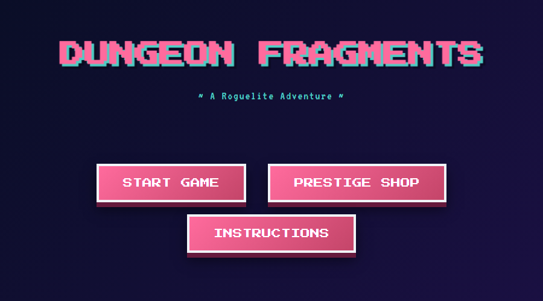

# Dungeon Fragments

A 16-bit roguelite grid crawler — turn-based, infinite floors, deep passive system.

**▶ [Play it in your browser](https://jarmstrong158.github.io/dungeon-fragments/)**



## What it is

Walk one tile, swing a sword, descend the stairs, die, spend fragments, repeat. The
loop is short; the build space is wide. ~80 passive effects, six rarity tiers,
dual- and tri-affinity mastery passives unlocked by levelling matching Affinities,
prestige meta-progression that carries between runs.

## Controls

| Key       | Action               |
|-----------|----------------------|
| WASD / ←↑↓→ | Move one tile      |
| Space     | Melee attack (adjacent enemies) |
| R         | AOE blast (costs MP) |
| E         | Drink potion         |

## Run it

Easiest: just [open the live site](https://jarmstrong158.github.io/dungeon-fragments/).

For local development:

```bash
# Option 1: Python
python -m http.server 8765
# then open http://localhost:8765/index.html

# Option 2: Node
npx serve .

# Option 3: just double-click index.html
# (Some browsers block Web Audio from file:// — http.server is safer)
```

## Project layout

```
index.html   thin HTML shell
style.css    styling (uses Press Start 2P + VT323 from Google Fonts)
music.js     procedural 16-bit lofi music engine (3 crossfading tracks)
game.js      everything else: combat, loot, passives, rendering, save data
```

## Current systems

- **Affinities** (ATK / DEF / SPD / CRIT / LUCK) — spend points every other level;
  higher Affinity biases drops toward matching passives, and unlocks dual/tri
  mastery passives.
- **Passives** — ~80 distinct effects on Rare+ gear, with stronger
  Legendary/Mythic/Ascended exclusives (Soulrend, Undying, Speedster, etc.).
- **Floor modifiers + endgame debuffs** — Convergence, Withering, Cursed Blood,
  Ironclad, Phase Shift, Arcane Wards, and more, unlocked between F35–F65.
- **Prestige** — Fragments earned on death buy 21 permanent upgrades across 4
  categories, plus 20 Echo milestones. Export/import via base64.

## Enemy kinds

Beyond the standard Grunt (chase + melee), regular enemies roll a kind that
shapes the encounter:

| Kind     | From floor | Behaviour                                                    |
|----------|------------|--------------------------------------------------------------|
| Grunt    | 1          | Chase the player, attack when adjacent.                      |
| Charger  | 5          | Telegraph a direction, then **dash 3 tiles** the next turn. Anti-kite. |
| Ranger   | 8          | Keeps distance 3–5; fires a projectile if aligned in line of sight. Forces movement. |
| Healer   | 12         | Heals adjacent allies for ~8% maxHP/turn. Stays back. Priority target. |

Bosses, Rare Bosses, and Elites keep grunt AI but stack on top via the
existing modifier system (Phase Shift, Ironclad, Frenzied, Vampiric, Convergence).

## Classes

Picked on the class-select screen before a run begins. Each class gives
starting Affinity and a unique starter item with a baked-in passive.

| Class     | Identity                                     | Starts with                                         |
|-----------|----------------------------------------------|-----------------------------------------------------|
| Brawler   | Wade in. Hit harder when surrounded.         | +5 ATK affinity, Cracked Hatchet (+6 ATK, Berserker 25%) |
| Trickster | Keep moving. Drops more loot, faster moves.  | +3 SPD / +5 CRIT / +2 LUCK affinity, Loaded Dice (Lucky 5, Swift 5, Phantom Step 15) |
| Sentinel  | Hold the line. Reward patience.              | +5 DEF affinity, Battered Cuirass (+4 DEF, Bulwark 1, Fortified 10%) |
| Mage      | Spend MP. Kill rooms. Repeat.                | +3 ATK / +2 LUCK affinity, Arcane Tome (Arcane 20, Siphon 8) |

## Roadmap

- [x] **Enemy variety** — Charger / Ranger / Healer kinds with distinct AI.
- [x] **Starting classes** — Brawler / Trickster / Sentinel diverge from turn 1.
- [x] **Build variety pass 1** — Kinetic Reserve nerfed (exponential → linear), Bulwark grants DEF as well as damage, Charger weight raised for more anti-kite pressure.
- [x] **Build variety pass 2** — Iron Roots stationary counter-passive (DEF affinity), Mage class for AOE-spam identity, per-class telemetry surfaced in Prestige Shop.
- [ ] Iterate: playtest, audit dual/tri mastery balance using the new telemetry.

## Tech notes

- Single-page, no build step, no framework, no dependencies.
- Procedural music synthesized in-browser via Web Audio (no audio assets).
- Persistence via `localStorage` for prestige meta-progression only.
- Pixel rendering via Canvas 2D on a 20×20 tile grid (320×320 px).
